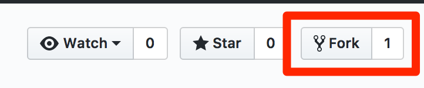

# Submitting Homework

### 1. Fork the lab to your account

### 2. Clone the lab

### 3. Create a branch

### 4. Do the work

### 5. Commit your changes

### 6. Push your working branch

### 7. Create a pull request
