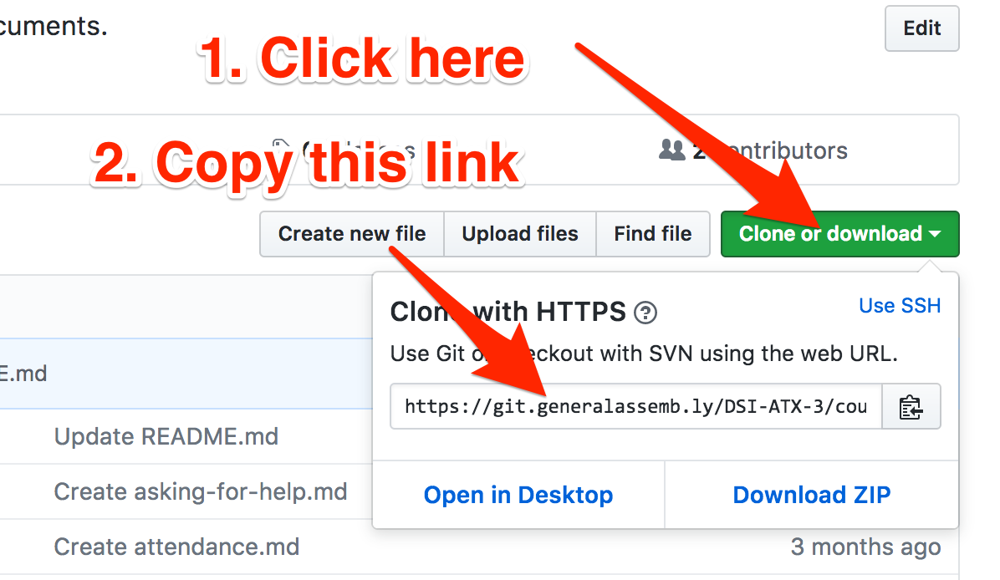
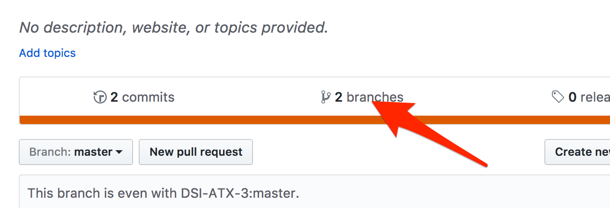
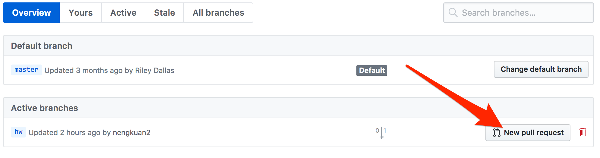

# Submitting Homework

#### 1. Fork the lab to your account


#### 2. Clone the lab


In your terminal, type the following:
```bash
git clone [PASTE THE URL YOU COPIED]
```

#### 3. Create a branch
```bash
cd the-directory-you-just-cloned
git checkout -b homework
```

#### 4. Do the work


#### 5. Commit your changes
```bash
git add .
git commit -m"Did work"
```

#### 6. Push your working branch
```bash
git push origin homework
```

#### 7. Create a pull request
1. Click on the Branches tab in GitHub

2. Click on "New Pull Request"

3. Fill out the form and submit
