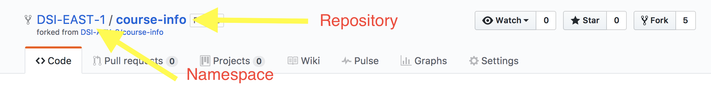
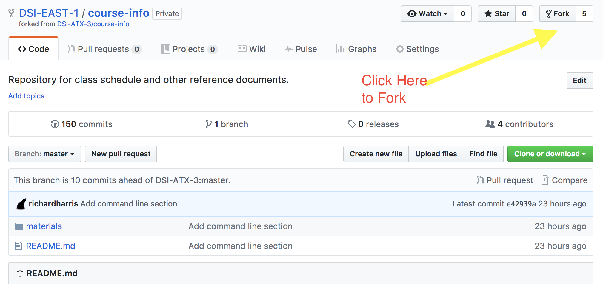
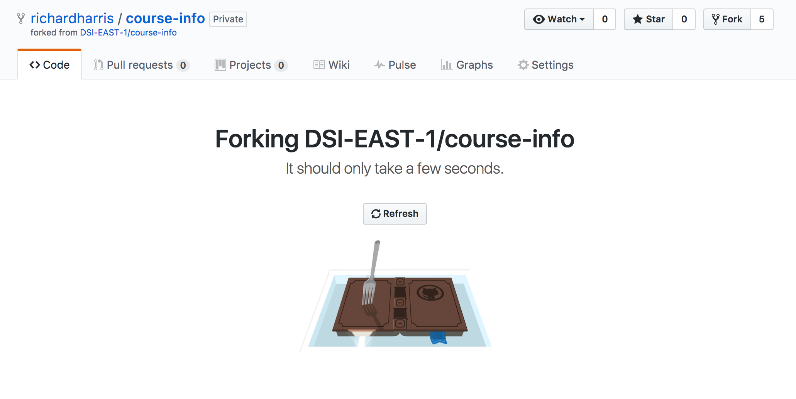
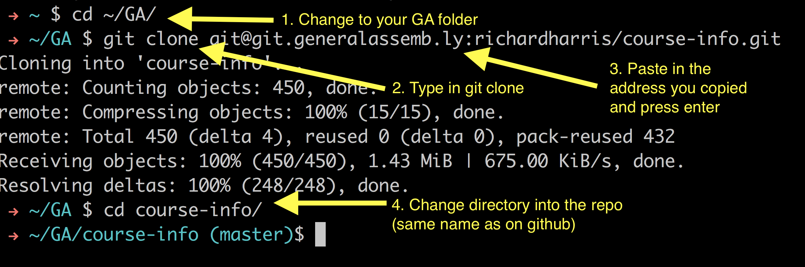
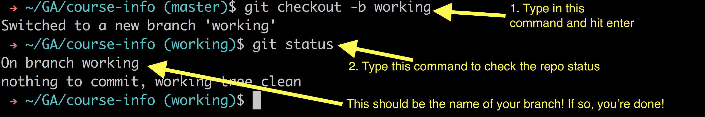

## Git vs GitHub and version control 

#### What is Git?


(with apologies to [xkcd.com](https://xkcd.com))

[Git](https://git-scm.com/) is:

- A program you run from the command line
- A distributed version control system

Programmers use Git so that they can keep the history of all the changes to their code. This means that they can rollback changes (or switch to older versions) as far back int time as they started using Git on their project.

A codebase in Git is referred to as a **repository**, or **repo**, for short.

Git was created by [Linus Torvalds](https://en.wikipedia.org/wiki/Linus_Torvalds), the principal developer of Linux.

#### What is Github?

[Github](https://github.com/) is:

- A hosting service for Git repositories
- A web interface to explore Git repositories
- A social network of programmers
- We all have individual accounts and put our codebases on our Github account
- You can follow users and star your favorite projects
- Developers can access codebases on other public accounts
- GitHub *uses* Git

#### What is git.generalassemb.ly?

- Same thing as Github but privately hosted on GA's servers. Otherwise the functionality is almost exactly the same.

#### Can you use git without Github?

Yes!

# So how does all of this work?

Git can be somewhat difficult to grasp conceptually, but we will introduce all of these features gradually over the next few weeks. 

# Git versus Github

One thing to keep in mind is that we'll be interacting with git on our local machines and Github online. Make sure that you are thinking about 1) where you are and 2) how that relates to other "versions" of that code. It takes some practice, but the more you practice, the easier it will get.

## Staging and Committing

The simplest way to think about git is to imagine it as a series of entries in a journal. Each of those entries is a saved state of the code. As we code, we make frequent saves of that code. We can then go back and return to different versions of the code, see how it has changed from different versions (and who made those changes), and take advantage of a bunch of other benefits.

### Key Concepts 

Git operates under a few concepts:

First, we have to consider the *working directory*: git tracks a specific working directory and all folders contained within it. This means that if we navigate out of the root working directory, changes we make are no longer tracked. However, anything within the working directory (and every folder within it) are tracked. 

Once we've made some changes that we are happy with, we need to add these to a *staging area* (this is known as the index within git parlance). This indicates to git which files we would like to save the current state of. At this point, nothing has been committed to history yet.

Finally, we want to *commit* the changes to long-term memory. Once we've committed the changes, they are part of the history of our repository forever (except for certain extreme cases). 

### What's under the hood?

> What git is actually doing is that instead of saving individual copies of each file, they are saving the difference between each successive version of the file. This helps keep the speed and size of the saved records dramatically but until we commit the changes in our files to the repository, the *HEAD* (most current commit) will not reflect anything new. That said, keeping in mind the fact that a git history is a chain of successive differences between files will help you make sense of various things going on.

### Installation

Let's start by getting some basic stuff installed and ready to go. You should have completed this during Installfest, however!

_1) Install Homebrew_

[Homebrew](http://brew.sh/) is a package manager for OS X that installs packages using the command line. It is very useful for us in general. To install it, run the following:

```bash
/usr/bin/ruby -e "$(curl -fsSL https://raw.githubusercontent.com/Homebrew/install/master/install)"
```

Note: You should be wary of pasting stuff you find on the internet directly into the command line. This is a reputable source and so in this case, everything is safe. That said, it's important to be aware of what could happen.

_2) Install git_

OS X generally has a (fairly old) installation of git ready to go. However, we want to (re-)install git through homebrew to keep it up to date. To do so, run the following:

```bash
brew install git
```

_3) Set Up a Github Account (at git.generalassemb.ly)_

You should have all done this by now.

_4) Set up a SSH key, link to git.generalassemb.ly, and add to your keychain_

We want to be able to securely communicate with GitHub to make sure that our code is going to the right place, etc. We could do so over https (just like most websites) but this requires frequent reauthorizations, etc. The typical way to link to GitHub securely is to use SSH (Secure Shell). We will use this by creating a set of private and public keys. We keep the private key safe by not sharing it with anyone, but we give the public key to any person or site that we want to securely communicate with. Once we've confirmed our identity with the target site, any time that we attempt to reconnect to it, our system will compare the public key (held by the target site) with our own private key -- if they are compatible, we know that the connection is authentic (and there are no MITM attacks, etc.) and we can access the systems without having to supply our password, etc.

Let's walk through the steps (this comes from [GitHub's Main Documentation](https://help.github.com/articles/generating-a-new-ssh-key-and-adding-it-to-the-ssh-agent/))

In your terminal, enter the following:

```bash
ssh-keygen -t rsa -b 4096 -C "your_email@example.com"
```

Make sure that you replace "your_email@example.com" with whatever email address you signed up with.

After some work, you should see the following appear on your screen:

```bash
Enter a file in which to save the key (/Users/you/.ssh/id_rsa): [Press enter]
```

If you do not already have a SSH key set up, go ahead and press enter to save it in the default space. If you do (or you don't know), let me know and we can work out next steps.

Next, you'll be asked to supply a password for your ssh key (essentially adding another layer of protection) -- I would suggest a secure password that you will remember. There will be times where you will need to enter this password again.

We would like to be able to access our SSH keys without having to enter our password frequently. To do that, we're going to add it to our keychain. 

```bash
eval "$(ssh-agent -s)"
ssh-add -K /path/to/private_key
```

Now we're set up on our side to connect to GitHub. We just have to tell GitHub which key is ours. At your command line:

```bash
pbcopy < ~/.ssh/id_rsa.pub
```

This copies our public key to our computer's clipboard. If you have multiple ssh keys (or have saved yours under a different name), make sure you copy the correct public key (it will end in `.pub`)

Next, head over to git.generalassemb.ly, log into your account, and go to your account settings (upper right hand corner). Within your settings, go to *SSH and GPG Keys* and click *New SSH Key*. In the title field, add in a descriptive title (I generally go for the laptop I am using, such as "GA Work Laptop"). Paste your public key into the Key field and click add key. If everything goes well, your accounts should be connected. 

### So how do we use it?

Let's run through a basic example of using git. In this example, we are going to create our own repository, add and commit a file, and *push* it up to GA's github. *Pushing* a repository refers to taking the git log that you have created locally and sending it to GitHub. The commands are below, but before you run them on your own, lets work through them together,

```bash
cd ~
mkdir my_first_git_repository
cd my_first_git_repository
touch readme.md
echo "hello world!" >> readme.md
```

What have we done here? We've used some of the commands that we've learned yesterday -- making a directory, changing our working directory there, and creating a file called `readme.md`. The last command `echo "hello world!"` repeats the string `hello world!`. When followed by `>>` we can append the result of a previous command (such as `echo`) into a file (in this case, `readme.md`). So now, we have a file called `readme.md` that has the text `hello world!` inside of it. We can check it with the following command:

```bash
cat readme.md
```

You should see all of the text in the file! Awesome!

Let's set up our repository, add `readme.md` to it, and commit!

```bash
git init
git status
git add readme.md
git commit -m "Hello world -- our first commit"
```

What did we do here? In order:

- `git init`: This command initializes a git repository in your working directory. This means that everything in the `my_first_git_repository` folder is now ready to be tracked by git.
- `git status`: This tells you 1) what files, if any have changed and 2) if they have been added to the staging area yet. When we run this, we should see that we have one file that is not added yet (`readme.md`)
- `git add readme.md`: This command adds a specific file to the index so that its changes will be tracked (in this case, it adds `readme.md` to the index)
- `git commit -m "Hello world -- our first commit"`: Here we commit our changes, saving the current state of our files to the git log. Every commit must have a message associated with it. This commit message should describe briefly whatever changes you've made (very helpful if you're looking in the past for a specific change!)

Let's make a couple of other changes before we send this up to GitHub proper:

```bash
git log
echo "this is a great file" >> readme.md
git status
git add readme.md 
git commit -m "My second commit"
```

Can you explain what we've done at each step?

At this point, we have a file (`readme.md`) with that looks like this:

```bash
cat readme.md
hello world!
this is a great file
```

We'd like to take this repository and *push* it to GitHub. What's *pushing* you ask? 

- *Push*: To take a local repository and move it up to a remote repository (i.e., on GitHub, etc.)
- *Pull*: To take a remote repository (i.e., on GitHub) and download it to your local machine

You might wonder how we push and pull without overwriting our code or losing data. We won't get into that at this point, but rest assured that there is a robust set of ways to avoid that exact situation (in fact, GitHub will not overwrite *anything* unless you are very explicit that you want data to be overwritten and lost).

Before we push we need to create a repository on GitHub and sync the repository to our local repository (so it knows where to send it). Go ahead and create a repository on GitHub with the name `my_first_git_repository`. Then, run the following command on your command line:

```bash
git remote add origin git@git.generalassemb.ly:richardharris/my_first_git_repository.git
git push -u origin master
```

Let's walk through what we're going to do before we do it.

- `git remote add origin` -- this adds a remote (i.e., not on our computer) repository. Origin is the name of that remote (we may have multiple remotes). Why origin? Convention, mostly.
- `git@git.generalassemb.ly` -- This is the user through which we are sending our data (we are talking to another computer after all!) The user is `git` (this is standard) and the address of that computer is `git.generalassemb.ly` (this is exactly what we type into the web browser when we connect!)
- `:richardharris/my_first_git_repository.git` -- this is the specific repository that we are adding. You'll have to switch my user name out for yours
- `git push -u origin master` -- this does two things. 1) it pushes the `master` branch (don't worry about that) of this repository up to the `origin` remote (which we just set up) and 2) the `-u` flag sets this remote to be upstream. Essentially that means that our local repository knows that what's up on the remote is something it will probably want to pull down at some point (in case you were working with multiple people and they had made changes).

Once you've ran it successfully, navigate back to your repository on GitHub and you should see _everything_ in your local repository, online! 

# Forking, Cloning, and Branches

There are many, many ways to use Github and git effectively. We're going to practice one method of many. However, it is **vital** that we do this every single time we get ready to work with course materials. These steps are:

1. **Fork** the repository to your Github namespace
2. **Clone** the repository from your Github namespace to your local machine
3. **Checkout** a `working` branch on your local machine

See the bottom of this readme for screenshots of what to do. **Make sure that you do this process every single time!**

##### Forking



This repository has two things:

1. A namespace (i.e., who owns this repo -- in this case, `DSI-EAST-1`)
2. A repository name (what is this repo called -- in this case, `course-info`)

*Forking* copies a repository from one owner and puts it under *your* namespace. Now you have your own copy on github that you can do _whatever you want_ with that will not change anything to the original one.

For example, if I (`richardharris` on github) forked the `DSI-EAST-1/course-info` repository, we would now have two versions of `course-info` existing in parallel:

- `DSI-EAST-1/course-info` (which I might have limited ability to change)
- `richardharris/course-info` (which I have **complete** control over)

Why would we do this? You now have complete access to the code under your own name and any changes are for your machine alone!

##### Cloning

Cloning is how you download the repository from Github to your local machine. This also creates a connection between the Github repository and your local copy so that you can `push` and `pull` easily.

Copy the **SSH** address of the repo (under the bright green button that says `Clone or Download`), go to your terminal, and type in the following:

```bash
git clone address@fromgithub:thatyoucopied
```

replacing everything after `git clone ` with the address you copied. This will create a copy of the repository on your local machine.

##### Checking Out a Branch

A **branch** is a different version of the same repository. We often want to have different versions of the same code available for us, for example:

- We might want the current version of the code on the production server
- We might want a version of the code that is fixing a particular bug
- We might want a version of the code that adds a new feature or creates a new model
- We might want a version of the code where we are exploring or trying new things out

Git can manage all these different versions of code _for us_! We can very easily switch between different versions of the code. We call these different versions of the code branches. 

**Master Branch**: Every git repository starts off with a branch called `master`. The `master` branch is typically the production or "gold-standard" version of the code. _Typically_ we do not want to just start adding to this version directly! Instead, we want to create a new branch and make our changes there, and then decide whether or not to accept those changes together. We're going to put that skill into practice as developers throughout this course.

Whenever we clone down a repository in this class, our next step will be to create a new branch of the code called `working`. You can call this branch anything that you want, but I find it's easier to be in the habit of picking a default name for yourself.

After cloning the repository, do the following on your command line:

```bash
git checkout -b working
```

`git checkout` is our command to change branches. The `-b` flag is a sign to git to create this new branch (do not add `-b` if the branch already exists!) Finally, `working` is the name of the branch that we want to change to.

> If you want to see what branches exist on your local machine, just input `git branch`

##### In pictures!

**1. Fork the repository**







You have forked successfully!

**2. Clone the repository to your local machine**




You have cloned succesfully!

**3. Checkout a `working` branch**


